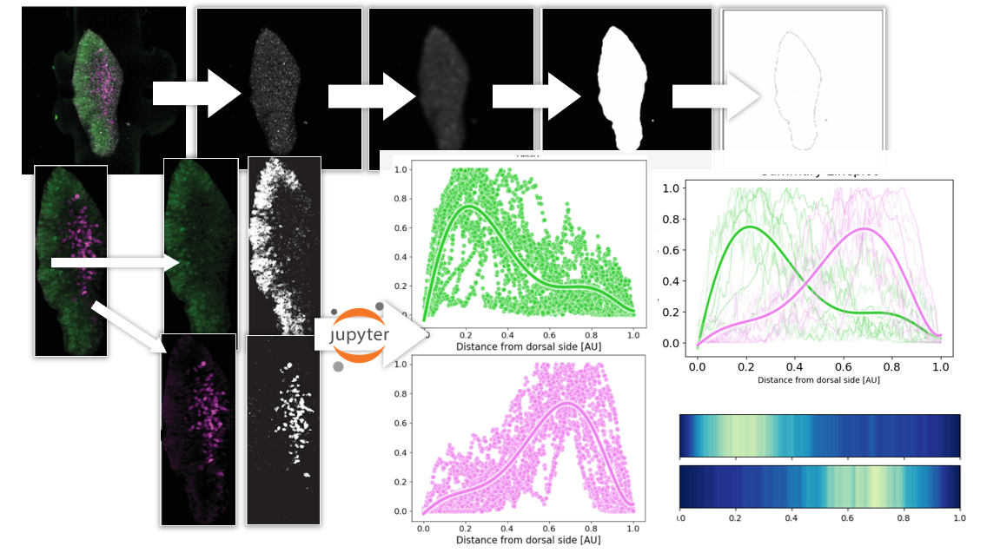

# Intensity Plotter

A collection of plotting functions to visualise immunostaining patterns along the AP axis of organoids.

Click the badge below to launch an interactive, self-contained version of the Jupyter Notebook 👩🏻‍💻

